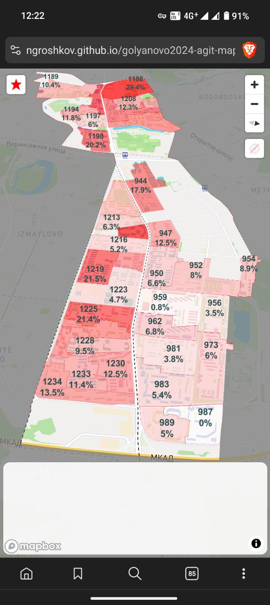

# Agitation Map

https://ngroshkov.github.io/agit-map

Simple custom web map application to support a field canvassing effort used by local self-organised activists during the campaign for the Moscow City Parliament.

App Tools: Mapbox, MBTiles, Typescript, React, react-map-gl, deck.gl, GitHub Pages
Data Sources: OpenStreetMap, Local electoral district boundaries, Local Election Commissions 
Data Management Tools: QGIS, Google Geocoding API, Kotlin DataFrame

## Getting Started with Create React App

This project was bootstrapped with [Create React App](https://github.com/facebook/create-react-app).

### Available Scripts

In the project directory, you can run:

 - `npm install` setup project with dependencies.
 - `npm start` runs the app in the development mode.\
   Open [http://localhost:3000](http://localhost:3000) to view it in the browser.
 - `npm run deploy` deploy the app to GitHub Pages for production.
